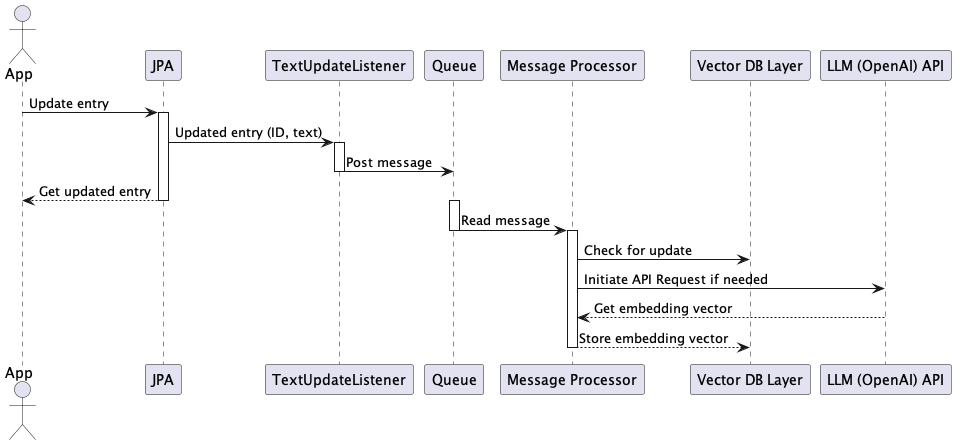

## How to build
- As a Vector DB Apache Lucene (https://github.com/apache/lucene) is used, which has support for similarity search. 
You need to patch it  as the maximum supported vector dimension (1024) at least in latest stable version is not 
enough for ChatGPT. I applied to the version 9.7.0 the following patch and built according 
Lucene Core documentation as artifact 'org.apache.lucene:lucene-core:9.7.0+knn2048'
```diff
Index: lucene/core/src/java/org/apache/lucene/index/FloatVectorValues.java
IDEA additional info:
Subsystem: com.intellij.openapi.diff.impl.patch.CharsetEP
<+>UTF-8
===================================================================
diff --git a/lucene/core/src/java/org/apache/lucene/index/FloatVectorValues.java b/lucene/core/src/java/org/apache/lucene/index/FloatVectorValues.java
--- a/lucene/core/src/java/org/apache/lucene/index/FloatVectorValues.java	(revision 01e2eb6944b8b9f4a931dfed75dffb3cc56eb341)
+++ b/lucene/core/src/java/org/apache/lucene/index/FloatVectorValues.java	(revision 2c1681a01a8e8039b598d25306fb89cf51574801)
@@ -29,7 +29,7 @@
 public abstract class FloatVectorValues extends DocIdSetIterator {
 
   /** The maximum length of a vector */
-  public static final int MAX_DIMENSIONS = 1024;
+  public static final int MAX_DIMENSIONS = 2048;
 
   /** Sole constructor */
   protected FloatVectorValues() {}
```
## How to run
- You need to annotate an entry with annotation and you text-getter with LlmText
```java
import org.novomax.llm.integration.spring.client.TextUpdateListener;

@Entity
@EntityListeners({TextUpdateListener.class})
public class YouEntity {
    // ...
    @LlmText
    public String getSomeText() {
    }
}
```

- Add org.novomax.llm.integration.spring.LlmConfig for Spring scan, e.g. 
```java
@SpringBootApplication(scanBasePackageClasses = {YourApplication.class, LlmConfig.class})
public class YouApp{/*...*/}
```
- property `org.novomax.llm.integration.spring.openai.api.key` should have your API key 
for openai
- Optional to have a search form without coding, you should configure mapping of 
URL Path for an entity with placeholder for ID (corresponding to ID of the JPA Entity)
```yaml
org:
  novomax:
    llm:
      integration:
        ui:
          searchOneMapping:
            "[yourpackage.YourEntity]": /path/to/view-entity/{0}
```

## How does it work

